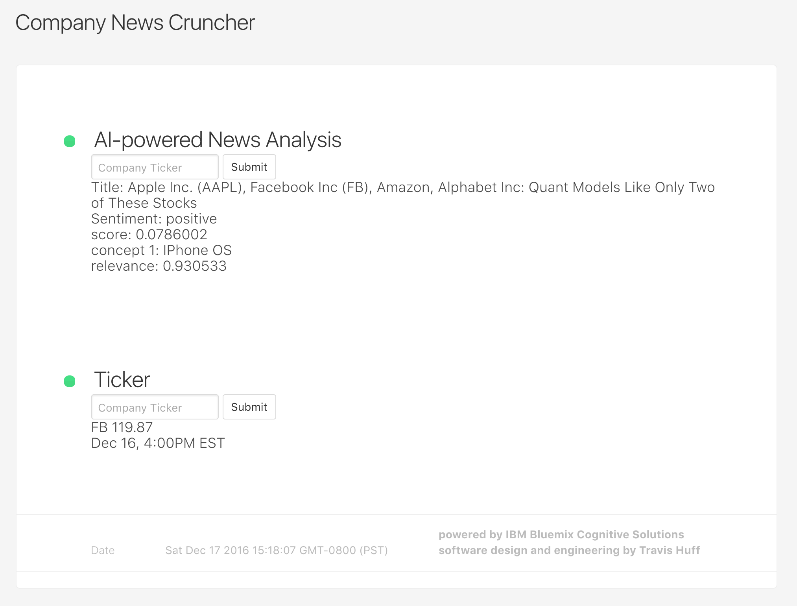

# Company News Cruncher

Company News Cruncher is a Bun-powered Express app with a small vanilla JavaScript front end for checking recent company news and stock quotes.



The app has two workflows:

- Search a company name or ticker and render a recent news headline with lightweight sentiment and concept extraction.
- Enter a stock ticker and render quote data from Nasdaq's public quote JSON endpoint, with a Twelve Data demo fallback and a graceful local fallback if providers are unavailable.

No API keys, database, build step, or front-end framework are required.

## Stack

- Runtime and package manager: Bun
- Module syntax: native ES modules
- HTTP server: Express 5
- Response caching: apicache
- Browser UI: static HTML, CSS, and modern vanilla JavaScript
- Tests: Bun's built-in `bun:test`

## Repository Layout

```text
.
|-- client/
|   |-- css/statuspage.css
|   |-- img/CNC-screen.png
|   |-- index.html
|   `-- js/
|       `-- index.js
|-- server/
|   |-- server.js
|   `-- watson.js
|-- test/
|   |-- client.test.js
|   |-- helpers.js
|   |-- news.test.js
|   `-- ticker.test.js
|-- bun.lock
|-- package.json
`-- README.md
```

## Requirements

- Bun `1.3.14` or newer

The project is locked with `bun.lock`. Do not use `package-lock.json` for this repo.

## Install

```bash
bun install
```

## Run

```bash
bun start
```

The app listens on port `3000` by default:

```text
http://localhost:3000
```

Override the port with `PORT`:

```bash
PORT=4000 bun start
```

## Test

```bash
bun test
```

or:

```bash
bun run test
```

The suite uses Bun's native test discovery and runs the `*.test.js` files under `test/`.

Current coverage focuses on fast, deterministic checks:

- The static client includes the required news and ticker form controls.
- The news controller returns the UI response shape with injected news data.
- Missing news and ticker inputs return JSON validation errors.
- Nasdaq quote JSON is parsed into the UI quote shape.
- Twelve Data quote JSON is parsed into the UI quote shape.
- Valid ticker lookup returns a normalized stock quote object.
- Provider failures return a stable fallback quote object instead of breaking the UI.

## Lint

```bash
bun run lint
```

To apply safe automatic fixes:

```bash
bun run lint:fix
```

## Browser Usage

Start the server, then open:

```text
http://localhost:3000
```

### News Form

Enter a company name or ticker in the news form, for example:

```text
Apple
Microsoft
NVDA
```

The UI renders:

- headline title
- sentiment label
- sentiment score
- first concept
- concept relevance
- source article link when available

### Ticker Form

Enter a ticker symbol, for example:

```text
AAPL
MSFT
NVDA
```

The UI renders:

- symbol
- latest price
- price change and percent change when available
- market status
- last trade timestamp
- quote source

## API

### `GET /`

Serves the static browser UI.

### `POST /getNews`

Accepts URL-encoded form data:

```text
company=Apple
```

Example response:

```json
{
  "title": "Apple shares rise after product launch",
  "docSentiment": {
    "type": "positive",
    "score": "0.25"
  },
  "concepts": [
    {
      "text": "Apple",
      "relevance": "1.00"
    }
  ],
  "sourceUrl": "https://example.com/apple-news",
  "publishedAt": "Fri, 05 Jun 2026 17:43:53 GMT"
}
```

Validation error:

```json
{
  "error": "Company is required."
}
```

### `POST /getTicker`

Accepts URL-encoded form data:

```text
ticker=AAPL
```

Example response:

```json
{
  "t": "AAPL",
  "l": "307.34",
  "lt": "Jun 5, 2026",
  "name": "Apple Inc. Common Stock",
  "change": "-3.89",
  "percentChange": "-1.25",
  "marketStatus": "Closed",
  "source": "Nasdaq"
}
```

Fallback response:

```json
{
  "t": "AAPL",
  "l": "Unavailable",
  "lt": "2026-06-06T03:22:18.000Z",
  "source": "Fallback"
}
```

Validation error:

```json
{
  "error": "Ticker is required."
}
```

## How It Works

`server/server.js` builds the Express app, serves `client/`, parses JSON and URL-encoded bodies, and wires the two POST endpoints through a short apicache window.

`server/watson.js` contains the app logic. The filename is historical; the current implementation no longer uses IBM Watson or Alchemy:

- `getNews` searches Google News RSS, parses the first item, scores headline sentiment with local keyword lists, and extracts simple concepts from the query and headline.
- `getTicker` normalizes the ticker, queries Nasdaq first, falls back to Twelve Data demo data, and returns a local fallback object if both providers fail.
- `createWatsonController` allows tests to inject deterministic provider functions without live network calls.

## Limitations

- News analysis is heuristic, not a machine-learning sentiment model.
- Concept extraction is intentionally simple.
- News lookup depends on Google News RSS availability.
- Quote lookup depends on public provider endpoints that can change or rate-limit.
- The UI is intentionally minimal and has no build pipeline.
- There is no authentication, persistence, monitoring, deployment config, or CI yet.

## Useful Commands

```bash
bun install
bun start
bun run lint
bun test
```

## License

MIT. See `LICENSE`.

## Author

Travis Huff
